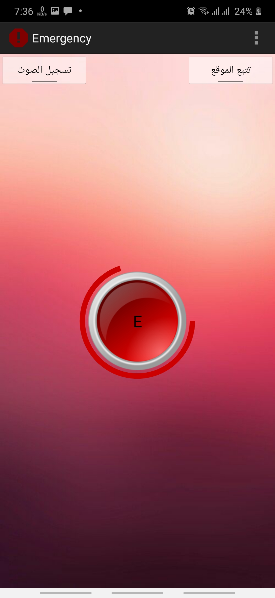
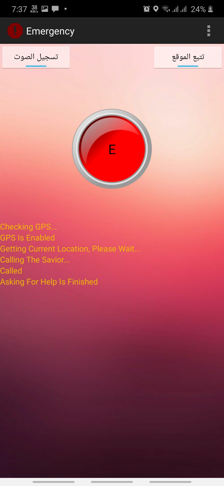
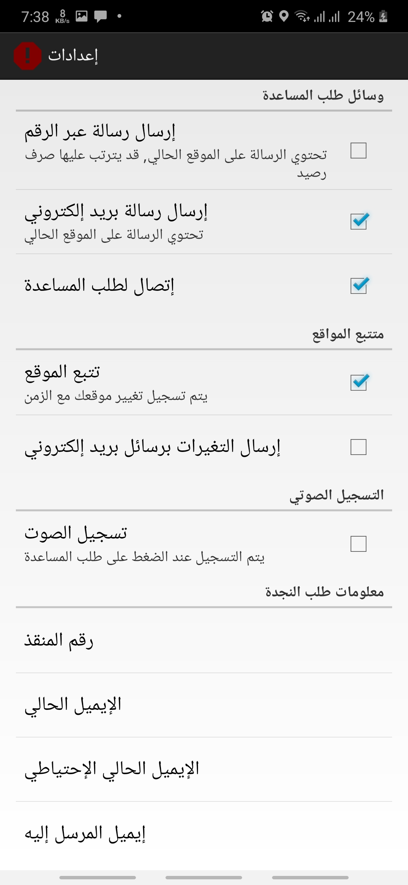

# Emergency
An android application for help users who fall into emergency situations by one press it will send SMS and email contain location(without internet), help message, and voice recording.

#### Compatible with **API Level 15** and higher
#### Support only arabic language

### Features 🚀
- **by one press**
- detecting location coordinates with GPS service by multi methods
- support location detecting **without internet**
- location tracking
- recording voices
- send SMS messages and emails contain location coordinates, location name, voice records to the savor
- direct call savor
- add savors by phone number, and email address
- save location tracks with sharedpreferences

## Some Screenshots 🎉
Home  |  Detecting Location  |  Settings
:-------------------------:|:-------------------------:|:-------------------------:
  |    |  
